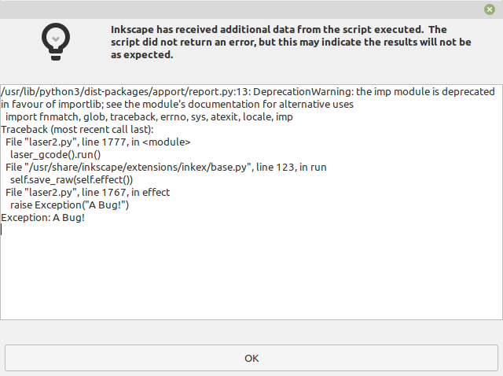
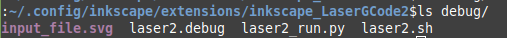
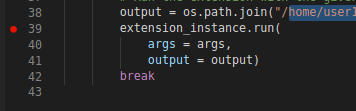

# inkscape ExtensionDevTools

A short script developed for the development/debugging of Inkscape Extensions.

Usage:

Inside of your exensions folder:

    git clone https://github.com/dapperfu/inkscape_ExtensionDevTools.git

Add the following before your <etxension>.run():

```
if __name__ == "__main__":
    try:
        import inkscape_ExtensionDevTools
        inkscape_ExtensionDevTools.inkscape_run_debug()
    except:
        pass
```

Workflow:

1. Call Inkscape Extension from Inkscape. See bug/deprecation warning.
  
  
  Inspect debug folder that debug files were generated:
  
  
  
2. Open extension folder in IDE (VSCode/Spyder/etc), add debugging.
  

3. Run ```<extension>_run.py``` from the debug folder.
4. Debug.
